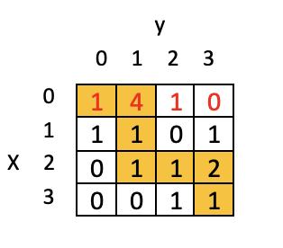

# The Mars Rover

This program simulates a mars rover, with a mission to find the safest path to a given destination as some areas are traversable while others may be dangerous due to high radiation exposure.

## Project Specification

The world (mars) is created as a 2D array of cells. The size of the world is N by N, so each column is of size N and each row is of size N as well. 
Each cell represents a possible location to which the rover can move. The rover cannot move to any cell directly unless it is directly to the right 
or below the rover's current location. To illustrate, consider the following world of 4 by 4 cells:

